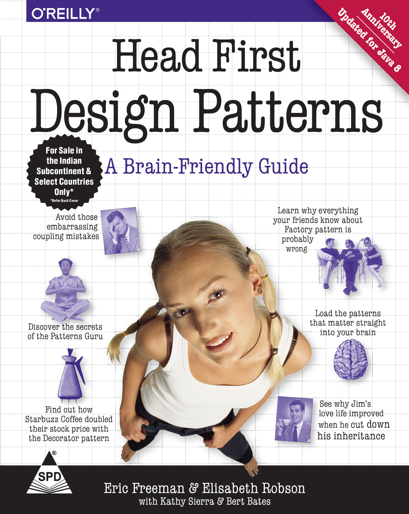

# Head First Design Patterns

**Head First Design Patterns** is a book that introduces a collection of design patterns and principles using humurous images and code written in [Java](https://docs.oracle.com/javase/8/docs/technotes/guides/language/index.html). This respository contains code demonstrating these patterns other languages.

| Patterns | Writeup | Implementations |
|----|----|----|
|The Strategy Pattern | [Link](patterns/strategy/README.md) |   |
|The Observer Pattern | [Link](patterns/observer/README.md) |  |
|The Decorator Pattern | |  |
|The Factory Method Pattern | |  |
|The Abstract Factory Pattern | |  |
|The Singleton Pattern | |  |
|The Command Pattern | |  |
|The Adapter Pattern | |  |
|The Facade Pattern | |  |
|The Template Method Pattern | |  |
|The Iterator Pattern | |  |

## The Book & Other Resources

*Update* A new version of the text was released in December of 2020! Find it on O'Reilly [here](https://www.oreilly.com/library/view/head-first-design/9781492077992/)

The text is a very approachable introduction to design patterns. If you have any Java experience, or are even just comfortable reading code and willing to learn a little, I recommend it.

The code from the book, as well as a number of free and/or alternate media design pattern resources are availble over at WickedlySmart's wesbite - [link](https://www.wickedlysmart.com/head-first-design-patterns/)

[Design Principles](./DESIGN_PRINCIPLES.md)
